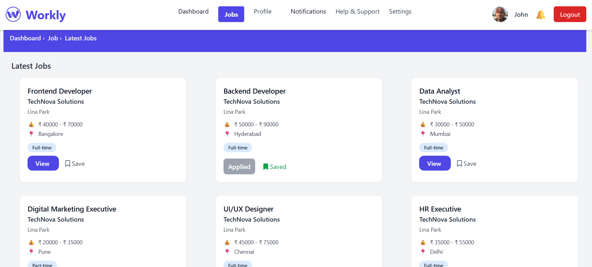
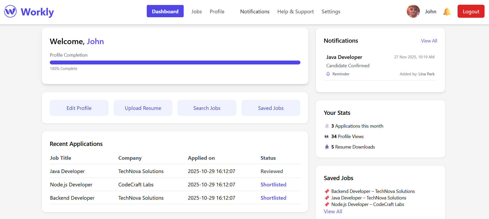
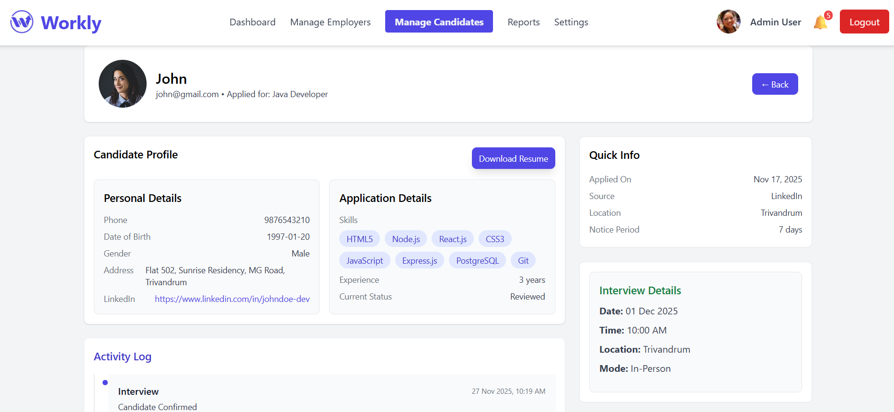
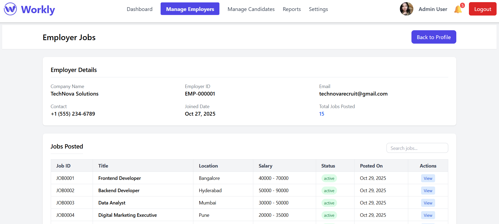
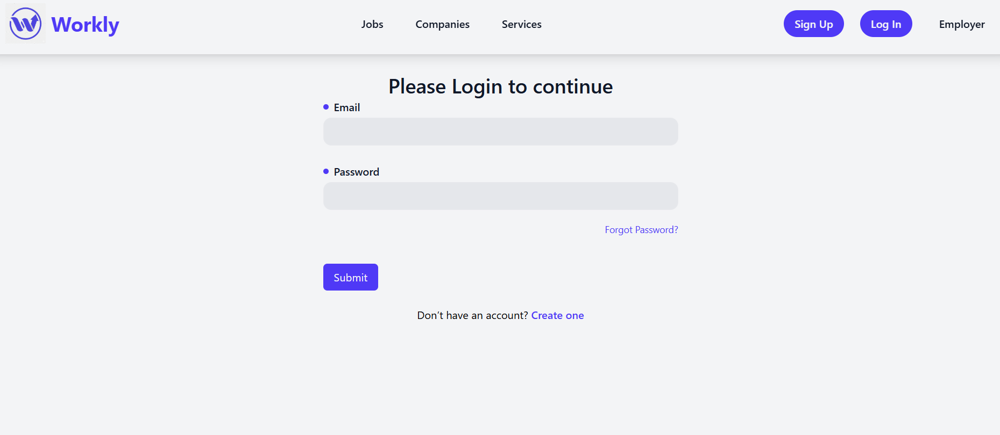
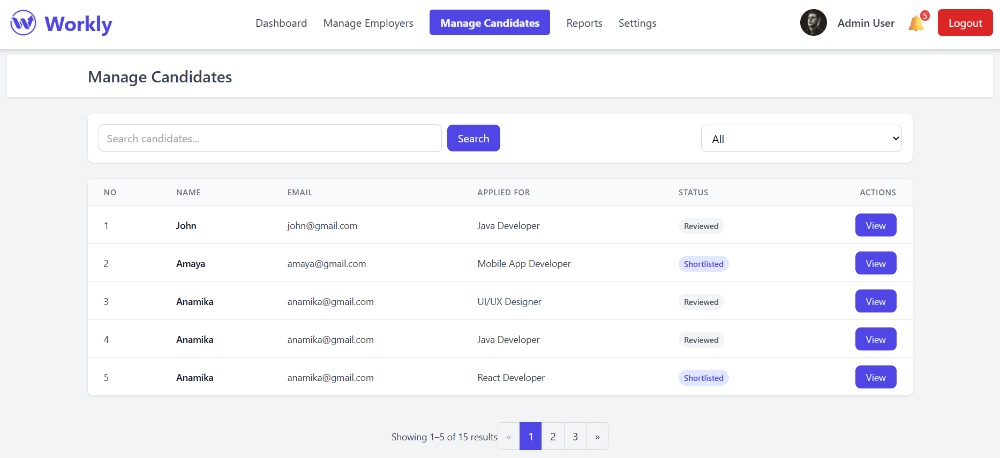
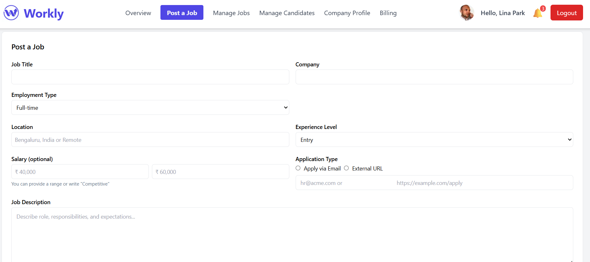
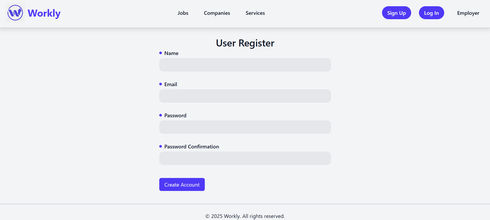

# Job Portal – Laravel

A fully functional Job Portal built with **Laravel**, designed for both **employers** and **job seekers**. Employers can post and manage job listings, while job seekers can browse and apply with resumes. The system also includes an admin panel for complete control.

---

## 🚀 Features

### 👥 User Roles

* **Job Seekers**
* **Employers**
* **Admin**

### ✨ Core Features

* Custom Authentication (Job Seeker & Employer login)
* Create, edit, update & delete job listings
* Search & filter jobs (role, location, type)
* Apply to jobs with resume upload
* Employer dashboard to manage applications
* Admin dashboard to manage users & jobs
* Fully responsive UI using Tailwind CSS

---

## 🛠 Tech Stack

| Layer        | Technology                                         |
| ------------ | -------------------------------------------------- |
| **Backend**  | Laravel 12                                         |
| **Frontend** | Blade Templates + Tailwind CSS                     |
| **Database** | MySQL
| **Auth**     | Custom Authentication                              |
| **ORM**      | Laravel Eloquent                                   |
| **Storage**  | Laravel File Storage                               |

---

## 🖼️ Screenshots

| Page               | Preview                                                   |
| ------------------ | --------------------------------------------------------- |
| Home Page          |                         |
| Job Listings       |                          |
| Job Details        |                |
| User Dashboard     |          |
| Employer Dashboard |  |
| Admin Dashboard    |        |
| User Dashboard     |          |
| Candidate Profile  |    |
| Company Profile    |        |
| Employer Jobs      |            |
| Job Applications   |      |
| Login              |                            |
| Manage Candidates  |    |
| Manage Jobs        |                |
| Post Job           |                      |
| Posted Jobs        |                |
| Register           |                      |

---

## ⚙️ Installation & Setup

### 1️⃣ Clone the repository

```bash
git clone https://github.com/ganeshkannanpm/Laravel-Job-Portal.git
cd Laravel-Job-Portal
```

### 2️⃣ Install dependencies

```bash
composer install
npm install && npm run build
```

### 3️⃣ Environment setup

```bash
cp .env.example .env
php artisan key:generate
```

### 4️⃣ Configure database

For SQLite:

```bash
touch database/database.sqlite
```

Update `.env`:

```
DB_CONNECTION=sqlite
```

### 5️⃣ Run migrations

```bash
php artisan migrate
```

### 6️⃣ Start server

```bash
php artisan serve
```
---
## 📦 Future Enhancements

* Email notifications
* Resume parsing
* Role-based permissions (Spatie)
* API support (Laravel API resources)
* Company pages & reviews

---

## 🤝 Contributing

Pull requests are welcome. For major updates, open an issue to discuss.

---

## 📄 License

This project is licensed under the **MIT License**.

---

## ✨ Credits

Developed by **Ganesh Kannan P.M**
